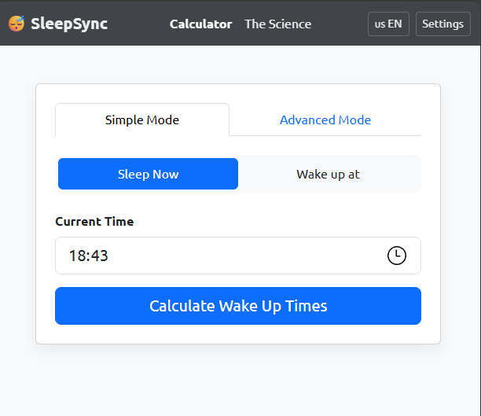
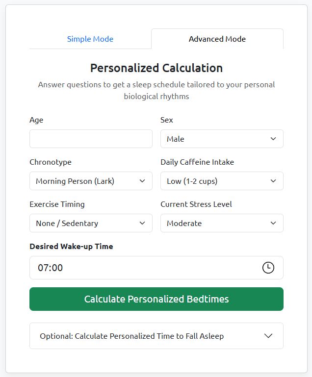

# SleepSync - Science-Based Sleep Cycle Calculator




**SleepSync** is a modern, refined web application that helps you calculate the optimal time to go to sleep or wake up. It's built on a foundation of scientific data about natural sleep cycles, offering both a simple, quick calculator and an advanced, personalized mode.

**[➡️ Try the Live Demo](https://sleepsync.pro)**

> **[🇷🇺 Read the Russian version of this document (Русская версия)](README.ru.md)**

---

## ✨ Key Features

* **Two Calculation Modes:**
    * **Simple Mode:** Quick calculation based on the scientifically established median 96-minute sleep cycle.
    * **Advanced Mode:** A personalized cycle length calculation based on your age, sex, chronotype, and lifestyle factors, supported by peer-reviewed research.
* **Scientific Foundation:** The app includes a dedicated page with a detailed **[overview of scientific research](science.html)** on sleep cycles and how individual factors affect them.
* **Modern UX/UI:**
    * Fully responsive design built with **Bootstrap 5**.
    * Support for both light and dark themes.
    * Clean, intuitive, and accessible interface.
* **Helpful Exports:**
    * **Add to Calendar:** Download an `.ics` file to add your recommended bedtime or wake-up time directly to your calendar.
    * **Export to text:** Get a clean summary of your results
* **PWA (Progressive Web App):** The application can be installed on a smartphone

## 🔬 Scientific Basis

This project doesn't just use the old "90-minute rule." The calculations are based on up-to-date research:

* **Cajochen et al. (2024):** The largest analysis to date, which established a median cycle duration of **96 minutes** and identified its dependency on age and sex.
* **Roenneberg et al. (2007):** Seminal research on the influence of chronotypes ("larks" and "owls") on circadian rhythms.
* **Phillips et al. (2017):** A study proving that sleep regularity is more critical for well-being than strict adherence to cycles.

## 🚀 How to Run Locally

1.  Clone the repository:
    ```bash
    git clone [https://github.com/ipirojnoe/sleepsync.git](https://github.com/ipirojnoe/sleepsync.git)
    ```
2.  Navigate to the project directory:
    ```bash
    cd sleepsync
    ```
3.  Open `index.html` in your browser. For the PWA (Service Worker) to function correctly, it's **recommended** to use a local server, such as the [Live Server](https://marketplace.visualstudio.com/items?itemName=ritwickdey.LiveServer) extension for VS Code.

## 📁 Project Structure
```
.
├── index.html         # Main application page
├── science.html       # Scientific overview page
├── style.css          # Minimal custom styles
├── js/                # Scripts
│   ├── app.js         # Main application logic & event listeners
│   ├── calculator.js  # Core calculation functions
│   ├── ui.js          # DOM manipulation functions
│   └── translations.js # Language translations
├── assets/            # Icons
├── screenshots/       # Screenshots
├── manifest.json      # PWA manifest
├── sw.js              # Service Worker
└── README.md          # This file
```

